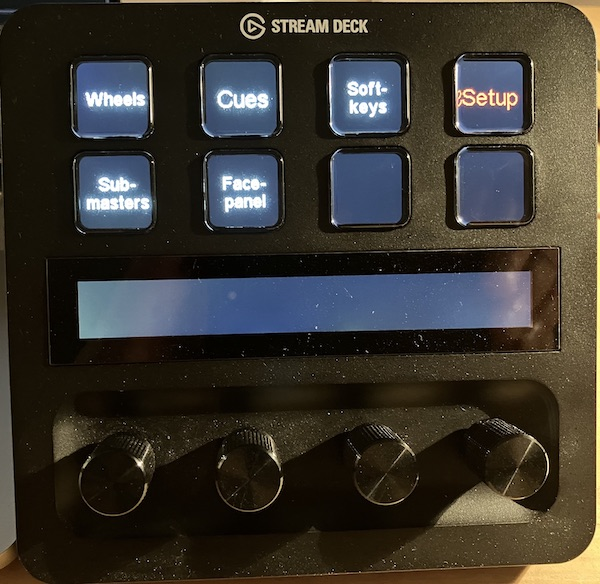
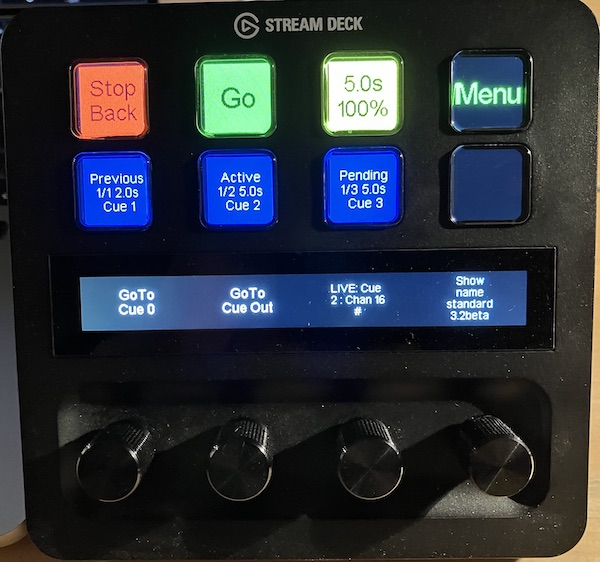
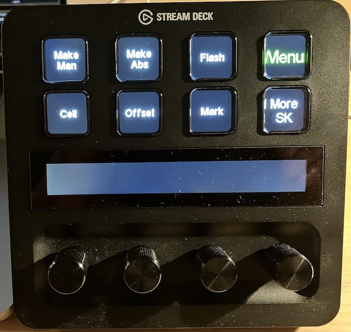

# streamdeckplus
Configuration file for use the ***Stream Deck +*** console with ETC Eos Family consoles.<br>
The file is a starting point for creating your own surfaces depending of your fixtures.<br>

### New version for Companion v3.x
There is a brand new version using Companion v3 and companion-module-etc-eos<br>

Following features are contained with the update
- Parameter sorted with categories
- Parameter Feedback
- TCP over SLIP
- Cue Handling
- and many more improvements

The example in the beta folder contains 7 pages
- Main Menu

- Setup

- Wheels

- Cues

- Softkeys

- Submasters

- Facepanel


Many thanks to Steve Palm for his great work.

### Old stuff in deprecated folder 

There are three deprecated versions, simple, extended and experimental .<br>

The simple version use two separate encoders for fine and course.<br>

The extended version gives some tricky fine/course/acceleration modes.
- There is no feedback of values possible
- Click on the Encoder gives you the Home value
- Extended version: Touching on a parameter name (about 1s touch) gives you a yellow frame which indicates special modes
  - Fine mode (16bit parameters)
  - Acceleration mode (8bit parameters) which gives you 4 clicks instead of one.
- The custom variable ```$(internal:custom_acceleration)``` allows you the set the clicks acceleration global.

There is an additional experimental folder which contain configurations for the next main release of Companion. For this files you need a beta of 3.x. <br>
The pro's of v3.x will automatic USB scan of the device and replacing the latch function with steps.
- sub_v3 gives you the possibility to use the encoders as a submaster
    - there are 3 buttons for acceleration
    - encoder click fires the sub 
- eos_v3 is for handling parameter like on console, but there are many things to do by Companion to make it better

Following preparations are necessary
- You need the new Stream Deck +
- You need to download the latest version 3.x, installed on your computer http://bitfocus.io
- You need an active network connection only if the EOS software is not local. 
- With EOS v3.2.x you can also use the loopback address 127.0.0.1 when you use Companion local on the same PC/Mac
- For WLAN you should give a static address instead of the DHCP address of your router
- The depreciated versions use only the generic OSC module not the EOS module, this changed with the release version
- You must do the right network configuration

